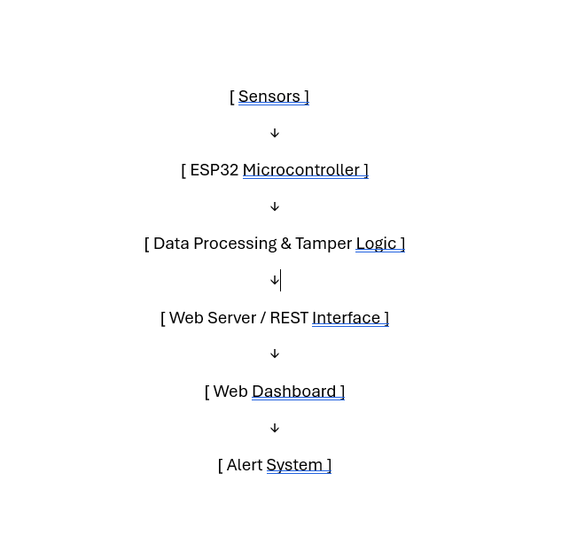

# smart-parcel-monitoring
Smart parcel tampering detection system with real-time sensor monitoring, anomaly detection, and web dashboard visualization.
## Features

- Real-time sensor data monitoring
- Tamper detection using LDR and vibration sensor
- Timestamp logging using DS3231 RTC
- Circular buffer log storage
- OLED-based real-time status display

## Tech Stack

- ESP32
- Embedded C
- DS3231 RTC
- LDR Sensor
- Vibration Sensor
- OLED Display (SSD1306)
## System Architecture

